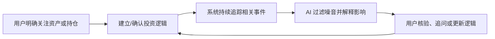
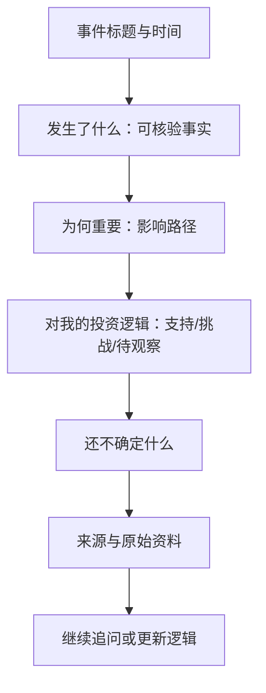
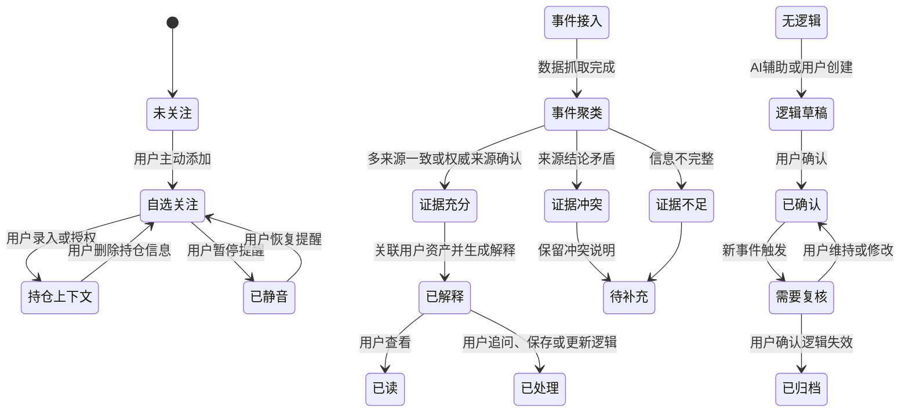
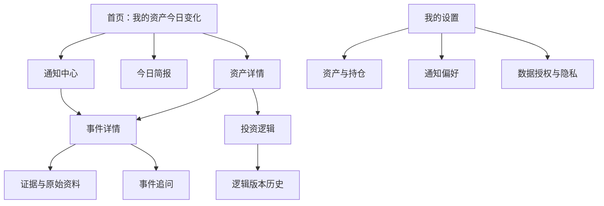

# 一、核心产品判断与设计原则

## 1.1 核心判断

推荐将产品定义为“以投资逻辑为中心的资产变化解释系统”，而不是“更聪明的财经资讯流”或“AI 荐股工具”。

产品的核心闭环是：

用户真正需要的不是更多信息，而是回答四个问题：

1. 发生了什么？
2. 这件事为什么与我关注的资产有关？
3. 它是否改变了我原先看好、看空或持有它的理由？
4. 我还需要关注什么，而不是现在被要求做什么？

因此，MVP 的主价值应是“解释变化 + 跟踪逻辑 + 保留决策权”，不应以选股、预测涨跌或直接交易建议作为卖点。

## 1.2 已知事实、设计判断与待确认事项

| 类型 | 内容 |
|---|---|
| 已知事实 | 平台已具备行情、新闻、公告、大模型对话、自选股及浏览记录能力。 |
| 已知事实 | 用户缺乏专业投研能力，且容易将确定性分析误解为交易建议。 |
| 设计判断 | MVP 应优先支持用户主动建立持仓或关注资产上下文，不应从浏览记录推断真实持仓。 |
| 设计判断 | “投资逻辑”应成为长期记忆单元；AI 可辅助生成和追踪，但不得自动改写。 |
| 待确认 | 目标市场、监管要求、是否具备券商持仓授权能力、研报与社交数据的版权及使用范围。 |
| 待确认 | 是否允许发送高频实时通知，以及通知的频率、时间段与风险等级规则。 |

## 1.3 核心设计原则

- 先证据，后结论：任何重要判断必须可回溯至来源、时间和相关数据。
- 事实、推断、未知分层展示：避免把推断包装为事实。
- 先解释逻辑变化，再讨论行动：不把“涨跌”直接等同于“买卖”。
- 用户确认个人信息与投资逻辑：AI 只能建议，不能替用户写入或修改。
- 无法可靠归因时明确说“不确定”：宁可保留多种解释，也不伪造单一原因。
- 以减少认知负担为标准：聚合、去重、排序和翻译专业内容，而非增加资讯数量。
- 默认克制通知：只推送与用户相关、影响明显且证据充分的事件。

---

# 二、产品定义与范围

## 2.1 产品定位

一款面向普通投资者的个人资产研究助理。它围绕用户明确关注的资产，持续追踪市场与公司信息，将事件转化为可核验、可理解、可追问的解释，并帮助用户维护自己的投资逻辑。

## 2.2 目标用户与高频任务

| 用户 | 核心痛点 | 高频任务 |
|---|---|---|
| 持有少量股票或基金的普通投资者 | 不知道持仓为何涨跌，也不知道新闻是否重要 | 查看日度变化、理解公告、确认风险 |
| 有自选股但未建立持仓的观察型用户 | 信息分散，不知道是否值得持续关注 | 追踪重点事件、比较不同资产变化 |
| 有初步判断但缺乏研究框架的用户 | 容易受短期行情和他人观点影响 | 记录买入逻辑、检查逻辑是否被证伪 |

## 2.3 产品解决与不解决的问题

| 解决的问题 | 不解决的问题 |
|---|---|
| 过滤与用户资产相关的重复信息 | 提供具体买入、卖出、加仓、减仓指令 |
| 解释行情、公告、新闻与投资逻辑的关联 | 承诺收益或预测确定价格走势 |
| 帮助用户记录、回顾和更新自己的投资逻辑 | 替用户完成交易、配置组合或承担风险 |
| 标注事实、推断、未知项和待验证条件 | 将不完整数据包装成确定结论 |
| 帮助用户核验来源和继续追问 | 将浏览行为自动解释为真实持仓或风险偏好 |

## 2.4 MVP 范围

### MVP 必选

- 用户手动添加自选资产；
- 用户主动录入持仓，或在未来接入后授权只读持仓数据；
- 每日资产简报；
- 重大事件和异动解释卡片；
- 原始来源、时间戳与证据链查看；
- 基于事件的追问式对话；
- 用户确认的“投资逻辑卡”；
- 新事件对既有投资逻辑的影响提示；
- 对“该买还是该卖”类问题的安全交互；
- 通知、隐私、数据授权及审计设置。

### 暂不纳入 MVP

- 自动交易或跳转下单；
- 个性化荐股、目标价和涨跌预测；
- 组合优化与仓位建议；
- 未经确认的持仓推断；
- 社交平台舆情作为核心决策依据；
- 覆盖全部市场和全部资产类别；
- 依赖人工逐条审核的实时投研服务。

## 2.5 关键产品假设

| 假设 | 验证方式 |
|---|---|
| 用户愿意主动录入少量持仓或确认关注资产 | 观察持仓/自选股建立完成率与后续留存 |
| 用户愿意维护简短的投资逻辑 | 观察逻辑卡创建率、确认率和后续更新率 |
| “逻辑是否改变”的解释比单纯资讯摘要更有价值 | 对比事件卡阅读率、追问率、收藏率与通知关闭率 |
| 来源和不确定性展示不会显著损害可读性 | 观察原始来源点击率、用户理解反馈与完读率 |
| 克制的通知策略能提升信任 | 观察通知开启率、点击率、关闭率和投诉率 |

---

# 三、核心用户动线

## 3.1 首次进入：建立信任与资产上下文

| 项目 | 设计 |
|---|---|
| 用户目标 | 快速获得与自己有关的信息，而非进入泛资讯首页。 |
| 入口 | 首次启动、未建立资产上下文时进入。 |
| 系统动作 | 展示产品能力边界、数据使用说明和风险提示。 |
| 用户操作 | 选择“添加自选资产”“录入持仓”或“暂不设置”。 |
| AI 动作 | 根据用户主动选择生成初始关注清单建议；不得根据浏览记录认定持仓。 |
| 状态变化 | 资产从“未建立”变为“自选”或“已录入持仓”。 |
| 成功结果 | 用户至少完成一个关注资产的建立。 |
| 退出路径 | 用户跳过后进入通用市场页；后续仅展示非个性化信息，并持续提供补充入口。 |

持仓信息分三级：

| 状态 | 来源 | 系统能力 |
|---|---|---|
| 无持仓信息 | 用户未提供 | 基于自选股提供关注资产研究体验 |
| 用户手动录入 | 用户填写标的、数量、成本等可选信息 | 根据用户明确录入的信息做个性化解释 |
| 已授权关联 | 未来接入的只读持仓数据 | 自动同步资产列表；涉及成本、持有时间等敏感信息时需单独说明用途 |

MVP 推荐优先支持“手动录入 + 自选股”，券商持仓授权标记为“需新增能力”。

## 3.2 建立投资逻辑

用户首次进入某一资产详情页时，系统提供“建立我的关注逻辑”入口，而非强制填写长问卷。

逻辑卡建议包含：

- 我关注或持有它的主要原因；
- 我预计重点观察的经营、行业或市场变量；
- 我不再认可这项逻辑的条件；
- 计划关注周期；
- 用户是否愿意接收对应变化提醒。

AI 可以根据用户输入及已知事实生成草稿，但只能保存为“待用户确认”。用户确认后，逻辑卡才进入持续追踪。

示例：

> 用户输入：“我看好该公司的海外业务增长，但担心利润率持续下降。”

系统生成：

- 核心假设：海外业务增长能够抵消国内增速放缓；
- 重点观察：海外收入增速、毛利率、费用率；
- 逻辑失效条件：连续多个披露周期中海外增长不达预期，且利润率继续恶化；
- 状态：待用户确认。

## 3.3 每日重要变化

首页不提供无限信息流，而提供“我的资产今日变化”。

每个资产最多展示一张主卡，按以下优先级排序：

1. 对用户已确认投资逻辑的影响；
2. 事件重要性；
3. 证据完整度；
4. 与持仓或自选资产的关联度；
5. 用户主动设定的关注偏好。

事件卡固定采用四层结构：

| 层级 | 展示内容 |
|---|---|
| 已发生事实 | 例如公告内容、价格变动、财报数据；必须附来源和时间。 |
| 可能关联 | 该事实与公司、行业、市场之间的已知关联。 |
| 对既有逻辑的影响 | “支持”“构成挑战”“暂无法判断”三类结果。 |
| 仍需观察 | 后续数据、公告、行业信息或验证条件。 |

用户可执行操作：

- 查看证据；
- 阅读原始公告或资讯；
- 追问“为什么重要”；
- 标记“与我无关”；
- 暂停该资产提醒；
- 修改投资逻辑；
- 保存为后续关注事项。

## 3.4 异动与重大事件提醒

推送只在以下条件同时成立时发送：

- 与用户主动添加的资产或确认持仓相关；
- 事件达到预设重要性门槛；
- 具备足够来源支持，或明确标记为“原因暂不确定”；
- 未超过用户设置的频率和免打扰限制；
- 与近期已推送事件不重复。

通知文案不直接呈现结论，而应表达事件与动作入口。例如：

> 你关注的 A 公司披露了季度业绩。初步信息显示，其海外收入变化可能影响你设置的“增长逻辑”。查看事实与待验证项。

通知点击后进入事件详情页，不跳转交易页。

## 3.5 事件详情与追问

事件详情页按“结论在前、证据可展开”的方式组织：

用户可以追问：

- “这和上季度相比有什么变化？”
- “这个消息会影响我之前关注的海外增长吗？”
- “市场为什么会有这样的反应？”
- “还有哪些信息可以验证这个判断？”

对话必须继承当前资产、当前事件、用户已确认逻辑和证据范围；每次回答均需区分事实、推断和未知。

## 3.6 投资逻辑变化闭环

当新事件与已确认逻辑相关时，系统不自动修改逻辑，而是创建一条“逻辑复核建议”。

| 情况 | 系统行为 | 用户操作 |
|---|---|---|
| 新证据支持原逻辑 | 标记“获得支持”，记录证据 | 查看、忽略或补充观察项 |
| 新证据挑战原逻辑 | 标记“需要复核”，说明挑战点 | 保持原逻辑、修改逻辑、设置后续观察条件 |
| 信息不足或冲突 | 标记“暂无法判断” | 查看冲突来源、等待后续事件、关闭提醒 |
| 用户确认逻辑失效 | 归档原逻辑，保留历史证据 | 创建新逻辑或停止追踪 |

## 3.7 用户追问“现在该买还是该卖”

系统不应只回复免责声明，也不能给出暗示性交易指令。推荐使用“决策条件澄清”路径。

### 标准交互

1. 明确边界：说明不能替用户给出具体交易指令或执行交易。
2. 回到用户已确认逻辑：展示当前逻辑是否被支持、挑战或尚未验证。
3. 呈现证据状态：哪些事实确定，哪些是推断，哪些仍未知。
4. 提供用户可自主判断的条件：例如“若你的前提是 X，则重点检查 Y 是否持续；若 Y 被证伪，原逻辑需要重新评估。”
5. 提供非交易型下一步：查看原始资料、更新逻辑、设置观察提醒、记录自己的判断。

示例回复：

> 我不能替你决定是否卖出。  
> 就你此前确认的“海外增长改善”逻辑而言，当前公告显示相关数据仍在改善，但利润率变化尚未得到充分验证。  
>
> - 已知事实：公司已披露的海外业务数据为……  
> - 当前推断：这对原逻辑构成部分支持，但不足以单独判断整体价值变化。  
> - 仍需观察：下一期利润率、管理层指引和同行表现。  
>
> 你可以选择查看证据、更新“逻辑失效条件”，或设置下一次财报提醒。

---

# 四、状态与触发机制

## 4.1 核心状态模型

## 4.2 状态说明

| 对象 | 状态 | 触发条件 | 用户感知 | 系统行为 |
|---|---|---|---|---|
| 资产 | 未关注 | 未被用户主动添加 | 无个性化卡片 | 不建立个性化追踪 |
| 资产 | 自选关注 | 用户手动添加 | 可见研究卡与提醒设置 | 基于公开信息追踪 |
| 持仓 | 手动录入 | 用户主动填写 | 显示“由你录入” | 仅按已授权字段个性化 |
| 持仓 | 已授权关联 | 用户授权只读接口 | 显示数据来源和更新时间 | 定期同步，支持撤销 |
| 事件 | 证据充分 | 权威来源确认或多源一致 | 可显示影响判断 | 可进入通知候选 |
| 事件 | 证据冲突 | 多来源不一致 | 显示“说法不一致” | 不输出单一确定归因 |
| 事件 | 证据不足 | 仅有低可信来源或信息缺失 | 显示“原因待确认” | 不作为强结论推送 |
| 逻辑 | 待用户确认 | AI 生成或用户编辑 | 草稿标签 | 不进入自动追踪依据 |
| 逻辑 | 需要复核 | 新事件触发失效条件或关键变量变化 | “逻辑可能变化”提示 | 请求用户确认，不自动改写 |
| 通知 | 候选 | 相关性、重要性、证据、频率均满足 | 用户未必可见 | 进入去重与频控 |
| 通知 | 已发送 | 通过频控与用户偏好检查 | 收到推送 | 记录发送、点击、静音反馈 |

---

# 五、AI、系统与用户责任边界

| 事项 | AI 自动完成 | 系统规则自动完成 | 需要用户确认 | 必须由用户决定 | 禁止行为 |
|---|---|---|---|---|---|
| 信息抓取、清洗与去重 | 是 | 是 | 否 | 否 | 不得篡改原始内容 |
| 标的、事件关联 | 是，可展示置信度 | 是 | 用户可纠正 | 否 | 不得把低置信关联表述为事实 |
| 个性化相关性排序 | 是 | 是 | 用户可调整偏好 | 是否关注资产 | 不得据浏览记录推断持仓 |
| 异动解释 | 是，附证据与未知项 | 否 | 否 | 用户是否采纳 | 不得伪造唯一原因 |
| 事实、推断和未知标注 | 是 | 是 | 用户可反馈错误 | 否 | 不得混淆三者 |
| 投资逻辑草稿 | 是 | 否 | 是 | 逻辑内容与失效条件 | 不得自动生效或覆盖旧逻辑 |
| 投资逻辑更新 | 提出复核建议 | 否 | 是 | 是否修改或归档 | 不得自动改写 |
| 风险提示 | 是 | 是 | 否 | 用户是否查看 | 不得以提示替代证据 |
| 通知发送 | 提供候选优先级 | 频控、免打扰、去重 | 用户设置偏好 | 是否开启 | 不得因低证据事件高频打扰 |
| 买卖类追问 | 提供条件化分析 | 风险表达校验 | 否 | 交易决策 | 不得输出具体买卖指令 |
| 持仓信息变更 | 否 | 同步只读数据 | 授权、修改、删除 | 是否提供数据 | 不得擅自写入或关联账户 |
| 交易执行 | 否 | 否 | 否 | 用户在外部渠道决定 | 禁止代客交易或自动下单 |

## 5.1 HITL 触发规则

| 触发场景 | 人工介入者 | 交互动作 | 用户未响应时 |
|---|---|---|---|
| AI 生成投资逻辑草稿 | 用户 | 确认、编辑或放弃 | 保持草稿，不用于追踪 |
| 新事件挑战已确认逻辑 | 用户 | 维持、修改、归档或稍后处理 | 仅保留“待复核”，不改变逻辑 |
| 数据源冲突 | 用户 | 查看各来源、等待后续信息 | 标记为未解决，不产生确定结论 |
| 高风险交易追问 | 用户 | 选择查看证据、设置提醒或更新逻辑 | 不主动引导到交易入口 |
| 模型疑似输出越界 | 平台运营/风控人员 | 抽检、复核、更新规则或模型策略 | 记录审计日志，必要时下线相关模板 |
| 用户反馈事实错误 | 平台运营/数据人员 | 复核来源与实体映射 | 先标记争议，避免重复传播 |

---

# 六、底层能力、工具与数据

| 能力 | 主要输入 | 输出 | 调用时机 | 现状 | 失败降级 |
|---|---|---|---|---|---|
| 行情数据服务 | 实时和历史行情 | 涨跌、成交、波动等数据 | 行情变化与页面查看时 | 已具备 | 显示最后更新时间，不做实时归因 |
| 新闻与公告接入 | 新闻、公告正文及元数据 | 原始资料与结构化事件 | 持续抓取 | 已具备 | 显示来源不可用或资料待补充 |
| 实体识别与标的关联 | 资讯、公告、资产主数据 | 公司、行业、主题关联 | 内容入库时 | 需新增/评估 | 标记关联不确定，不做个性化推送 |
| 去重与事件聚类 | 多来源内容 | 统一事件簇 | 内容入库时 | 需新增 | 按来源分别展示，降低摘要确定性 |
| 重要性与相关性排序 | 事件、资产、用户授权偏好 | 事件优先级 | 简报和通知生成时 | 需新增 | 使用规则排序，不做精细个性化 |
| 行情异动检测 | 实时/历史行情 | 异常波动事件 | 定时或流式触发 | 需新增 | 仅展示行情事实，不解释原因 |
| 检索与证据引用 | 事件、公告、新闻、行情 | 可追溯证据集合 | 回答和生成卡片时 | 需新增 | 限制回答为“暂无法基于现有资料判断” |
| 大模型分析编排 | 用户问题、资产上下文、证据集合 | 分层解释和后续问题 | 事件解释、对话、逻辑草稿 | 已具备基础能力 | 不生成投资判断，仅展示原始资料 |
| 投资逻辑存储 | 用户确认的逻辑卡 | 可版本化逻辑记录 | 用户创建和修改时 | 需新增 | 仅保存用户手动笔记 |
| 用户授权与隐私管理 | 用户授权、持仓数据、偏好 | 权限状态和审计记录 | 首次使用及设置变更 | 需新增/待确认 | 回退至自选股与匿名通用体验 |
| 通知编排与频控 | 事件优先级、用户偏好 | 推送候选与发送记录 | 事件触发时 | 需新增 | 仅在站内简报展示 |
| 内容安全与表达校验 | 模型输出、风险规则 | 越界拦截、重写或转人工队列 | 每次输出前 | 需新增 | 拒绝风险结论，转为证据浏览路径 |

## 6.1 数据可信度策略

来源按可信度分层，但不将低层来源直接排除：

| 来源层级 | 示例 | 适用方式 |
|---|---|---|
| 一级 | 上市公司公告、交易所披露、正式财报 | 可作为关键事实依据 |
| 二级 | 权威财经媒体、结构化行情数据 | 可作为事实补充或事件背景 |
| 三级 | 券商研报摘要 | 明确标记为机构观点，不当作事实 |
| 四级 | 社交平台讨论 | 仅作为市场关注线索；不得单独形成结论 |

社交平台数据、研报全文能力和持仓接口均不是当前已知能力，不能作为 MVP 前提。

---

# 七、PRD

## 7.1 产品目标

帮助普通投资者持续理解其关注资产的关键变化，并判断这些变化是否影响其已确认的投资逻辑。

## 7.2 非目标

- 不提供个性化交易指令；
- 不代替用户完成投资决策；
- 不承诺收益或预测价格；
- 不以增加内容消费时长为核心目标；
- 不默认获取或推断用户敏感金融信息。

## 7.3 信息架构

## 7.4 功能需求与优先级

| 编号 | 功能 | 优先级 | 用户场景 | 核心要求 |
|---|---|---:|---|---|
| FR-01 | 自选资产管理 | P0 | 用户建立关注范围 | 用户可主动添加、删除、分类和静音资产 |
| FR-02 | 手动持仓录入 | P0 | 用户希望获得更相关解释 | 字段最小化、可编辑、可删除、明确数据用途 |
| FR-03 | 每日重要变化 | P0 | 用户快速了解关注资产 | 去重、排序、展示事实与逻辑影响 |
| FR-04 | 事件详情 | P0 | 用户理解某条事件 | 提供事实、影响路径、未知项和原始来源 |
| FR-05 | 事件追问 | P0 | 用户继续理解事件 | 基于当前证据回答，输出须带来源与时间 |
| FR-06 | 投资逻辑卡 | P0 | 用户记录和回顾判断 | AI 可生成草稿，用户确认后生效，保留版本 |
| FR-07 | 逻辑复核 | P0 | 新事件挑战原判断 | 仅提示，不自动改写；支持维持、修改、归档 |
| FR-08 | 安全问答 | P0 | 用户询问买卖 | 不给指令；转化为条件、证据和待观察项 |
| FR-09 | 通知与频控 | P0 | 用户获取重要事件 | 相关、重要、证据充分、可关闭、可静音 |
| FR-10 | 来源与审计 | P0 | 用户核验信息 | 展示来源、时间、引用段落和生成依据 |
| FR-11 | 持仓账户授权 | P1 | 用户减少手动维护 | 仅只读、明确授权、支持撤销和同步状态 |
| FR-12 | 研报与舆情分析 | P1 | 用户了解市场观点 | 明确观点属性，不代替事实或投资结论 |
| FR-13 | 跨资产逻辑联动 | P2 | 用户理解组合风险 | 需在用户授权和合规范围明确后评估 |

## 7.5 核心异常与降级机制

| 异常 | 产品行为 |
|---|---|
| 行情延迟或不可用 | 明示最后更新时间；暂停基于实时价格的归因结论 |
| 新闻、公告来源不可用 | 保留已有证据；明确资料不完整 |
| 多来源冲突 | 并列展示冲突观点，标记“暂无法确认” |
| 仅发现社交传闻 | 不推送为确定事件；仅在用户主动查看时提示其未经验证 |
| 模型无法找到足够证据 | 直接说明无法判断，提供可查看的原始资料 |
| 用户撤销数据授权 | 停止同步和个性化处理；删除或按政策匿名化已授权数据 |
| 用户输入交易指令需求 | 不输出买卖建议，进入条件化分析模板 |
| 用户逻辑长期未维护 | 轻提示重新确认；不默认删除或修改 |

## 7.6 核心指标

| 指标维度 | 指标 |
|---|---|
| 激活 | 首次添加资产率、首次创建或确认逻辑卡率 |
| 价值感知 | 事件详情查看率、来源展开率、有效追问率、逻辑复核完成率 |
| 内容质量 | 关键结论引用覆盖率、事实/推断/未知标签完整率、用户纠错率 |
| 通知质量 | 通知点击率、通知静音率、关闭推送率、重复事件投诉率 |
| 安全性 | 买卖指令越界率、无证据结论率、来源冲突被错误合并率 |
| 留存 | 周活跃研究用户占比、连续查看简报率、逻辑卡复访率 |

## 7.7 MVP 验收标准

| 验收项 | 标准 |
|---|---|
| 事实可追溯 | 所有事件卡中的关键事实均可查看来源、发布时间和对应原文入口。 |
| 不确定性表达 | 无法确认异动原因时，页面必须展示“原因暂无法确认”及已知候选因素，不得输出唯一原因。 |
| 逻辑变更保护 | AI 生成或建议的投资逻辑，未经用户确认不得进入正式逻辑状态。 |
| 交易边界 | 对买卖类提问，不得输出明确买卖、仓位、价格或时点指令。 |
| 持仓隐私 | 用户未主动录入或授权时，系统不得将浏览记录标记为持仓。 |
| 通知控制 | 用户可按资产关闭、恢复和调整通知；同一事件簇不能重复推送。 |
| 降级可用 | 数据或模型不可用时，用户仍可查看最后一次有效信息及原始资料入口。 |
| 来源冲突 | 存在冲突来源时，系统必须保留冲突状态，不能自动生成确定结论。 |

---

# 八、重点场景示例

## 场景一：持仓公司发布重要公告

**触发：** 用户已录入 A 公司持仓，并确认逻辑为“海外收入增长将带动长期增长”。公司发布季度业绩公告。

事件卡：

> **A 公司披露季度业绩：海外收入同比增长，但利润率承压**  
> 时间：公告发布后 12 分钟  
> 证据完整度：较高  
>
> **已发生事实**  
> - 公司公告显示，海外收入同比增长。  
> - 公司公告显示，整体毛利率较上一报告期下降。  
>
> **对你的投资逻辑的影响：需要复核**  
> 这支持了你关注的“海外增长”前提，但利润率变化可能削弱增长向利润转化的效果。  
>
> **还需观察**  
> - 管理层对利润率变化的解释；  
> - 下一期海外业务的盈利表现；  
> - 费用率是否继续上升。  
>
> [查看公告原文] [为什么这会影响利润率？] [复核我的投资逻辑]

用户点击“复核我的投资逻辑”后，进入逻辑对比页：

| 原逻辑 | 新证据 | 用户可选操作 |
|---|---|---|
| 海外增长将改善长期增长质量 | 海外增长符合预期，但利润率承压 | 保持原逻辑 / 修改观察指标 / 设置下一期提醒 / 归档逻辑 |

系统不会自动得出“应继续持有”或“应卖出”的结论。

## 场景二：明显异动但无法确认唯一原因

**触发：** 某自选股盘中出现显著波动，系统检测到多条媒体消息和行业变化，但没有公告或权威来源确认唯一原因。

事件卡：

> **B 公司盘中波动明显，当前原因尚无法确认**  
> 时间：14:20  
> 证据完整度：有限  
>
> **已知事实**  
> - 当前价格较上一交易日收盘出现明显变化。  
> - 暂未发现公司同期正式公告。  
>
> **可能相关的公开信息**  
> - 行业出现新的监管讨论；  
> - 多家媒体提及同业公司的经营变化。  
>
> **当前无法确认**  
> 现有资料不足以确认上述信息是否为本次价格波动的直接原因。  
>
> [查看行情] [查看相关资讯] [后续有官方信息时提醒我]

系统状态为“证据不足”，不推送“利空导致下跌”或“市场误杀”等结论。

## 场景三：用户追问“所以我现在应该卖吗？”

用户：

> 所以我现在应该卖吗？

系统：

> 我不能替你决定是否卖出，也不会给出具体交易指令。  
>
> 基于你此前确认的逻辑，当前事件的影响是“需要复核”，而不是已经证明逻辑失效。  
>
> **已知事实**：海外收入仍在增长，利润率出现压力。  
> **当前推断**：增长质量是否受影响，取决于利润率变化是短期因素还是持续趋势。  
> **仍不确定**：管理层后续指引、下一期盈利数据及行业成本变化。  
>
> 如果你原本的判断高度依赖“增长会同步改善利润”，这次信息值得重点复核；如果你更关注长期收入扩张，则可以继续跟踪利润率是否在后续恢复。  
>
> [查看原始公告] [更新我的逻辑失效条件] [设置下一期财报提醒]

---

# 九、上线前必须确认的事项

- 目标国家或地区的金融内容、投资建议、持仓数据和通知合规要求；
- 行情、新闻、公告、研报和社交数据的授权范围、时效要求及展示限制；
- 是否接入券商账户，以及授权、撤销、保存期限和数据隔离方式；
- 风控团队对买卖类问答、模型越界、投诉处置和人工复核的标准；
- 资产覆盖范围：股票、基金、ETF、债券或其他品类；
- 实时异动、盘中推送和非交易时段推送的策略；
- 用户反馈、错误纠正、内容申诉和审计留痕机制。
