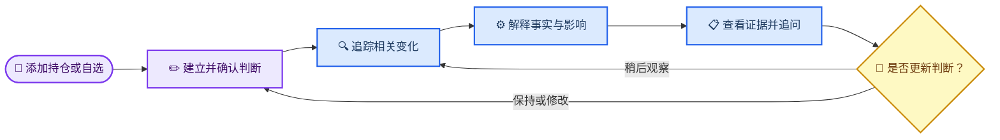
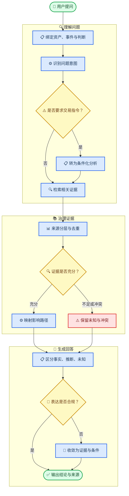
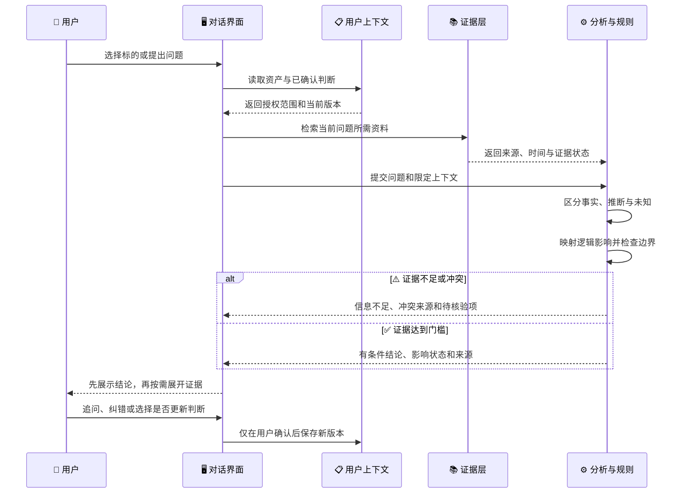

# AI 投研助手产品与交互方案说明

_基于 MVP PRD 与当前本机 MVP 形成的产品说明文档；实现以真实公开行情、事件与可追溯证据为优先，模型不可用时明确展示失败状态。_

---

## 📋 核心结论

AI 投研助手不是资讯聚合器、荐股工具或交易代理，而是一个**以用户投资逻辑为中心的资产变化解释系统**。它只围绕用户主动添加的持仓和自选标的工作，把分散事件整理成可核验、可追问的解释，并帮助用户判断：新信息是否触及自己原来的判断。

产品价值可以压缩为一条链路：

> 用户明确关注什么 → 系统发现相关变化 → AI 基于证据解释影响 → 用户核验并决定是否更新自己的判断。

这款产品成立，需要同时满足三个条件：

1. **信息相关**：内容确实来自用户主动建立的资产范围，而不是泛市场信息流。
2. **分析可信**：结论能回到来源、时间、事实与推理过程；证据不足时允许没有结论。
3. **权责清晰**：AI 负责整理、解释和提出复核建议，用户负责确认投资逻辑并作出最终决策。

任何一项缺失，产品都会退化：只做到第一项是个性化资讯流，只做到第二项是通用研究问答，只强调行动而缺少第三项则容易越界为交易建议。

## 🎯 产品定位与边界

### 产品定义

面向持有少量股票或基金、有自选标的、但缺乏完整投研框架的普通投资者，持续回答四个问题：

1. 发生了什么？
2. 为什么与我关注的资产有关？
3. 是否改变了我原先关注或持有它的理由？
4. 接下来应核验什么？

### 解决与不解决的问题

| 产品负责 | 产品不负责 |
| --- | --- |
| 聚合并去重与个人资产相关的信息 | 提供泛市场资讯流 |
| 解释事实、影响路径与未知项 | 承诺收益或预测确定价格 |
| 对照用户已确认的投资逻辑 | 输出买入、卖出、仓位、价格或时点指令 |
| 提供来源、时间和引用片段 | 把传闻或单一观点包装成事实 |
| 协助起草、复核和版本化判断 | 未经确认自动修改用户判断 |
| 将买卖问题转化为条件化分析 | 替用户交易或承担投资风险 |

### 最小信息架构

桌面端不使用仪表盘、卡片矩阵或多级页面承载功能，而只保留四个稳定对象：

| 对象 | 用户看到什么 | 承担的任务 |
| --- | --- | --- |
| 动态 | 当前标的最重要的变化与影响状态 | 开始阅读和继续对话 |
| 标的切换器 | 用户主动添加的持仓与自选 | 切换研究上下文 |
| 对话输入区 | 快捷问题与自由输入 | 追问原因、证据、影响和观察项 |
| 研究档案与详情面板 | 判断、数据、推断、来源、标的管理与设置 | 按需核验复杂信息，不打断对话 |

“动态”不是一个待办状态，也不是新闻频道，而是用户从自己的持仓和自选向外理解变化的入口。首页始终保持为 Chatbot；复杂功能只在用户需要时展开。

## 👤 用户、场景与首次使用

### 核心用户

| 用户类型 | 当前困难 | 产品提供的最短路径 |
| --- | --- | --- |
| 少量持仓的普通投资者 | 不知道涨跌和新闻是否真正重要 | 查看与持仓相关的首要动态，再核验证据 |
| 有自选但未持仓的观察者 | 信息分散，不知道后续看什么 | 选择自选标的，建立观察变量和提醒 |
| 有初步判断的非专业用户 | 容易受短期价格和他人观点影响 | 记录原判断，用新证据持续复核 |

### 首次进入

首次进入时，系统不能默认用户知道页面重点，因此通过 5 步 Spotlight 导览建立使用顺序：

1. **选择标的**：只显示用户的持仓和自选。
2. **查看动态**：先读最重要的变化及其影响状态。
3. **继续理解**：用快捷问题追问，或展开事实、推断和未知项。
4. **自由追问**：输入框自动继承当前标的、事件和证据。
5. **研究档案**：集中核验判断、数据、推断与来源；新证据只提醒，不自动修改用户判断。

导览使用文字气泡、单一高亮目标和暗色遮罩，可跳过、回退、退出或重新启动。它只解释主流程，不介绍次要设置。无持仓或自选时，页面只提供“添加持仓”和“添加自选”，不以泛资讯填充空状态。

## 🔄 产品交互主线

产品围绕“资产—事件—解释—判断”形成持续循环，而不是以一次回答结束。

### 一次典型使用

1. 用户选择“腾讯控股 · 持仓”。
2. 系统显示该标的当前最重要的一条动态，而不是事件列表。
3. 首条回答先给一句结论，再给关键事实和影响状态。
4. 用户点击“为什么重要”“查看证据”或“这会影响我原来的判断吗”。
5. 对话继续沿用当前资产、事件、已确认判断和证据范围。
6. 需要核验时，右侧面板展示来源、时间、引用片段和证据边界。
7. 若新证据触及原判断，系统提出复核建议；用户选择保持、修改观察项或稍后处理。

### 结论的三层表达

为了避免把“有变化”直接翻译成“该行动”，界面同时表达三种不同信息：

| 层次 | 取值 | 回答的问题 |
| --- | --- | --- |
| 影响状态 | 暂未影响、值得留意、可能影响原判断、信息不足 | 这件事现在需要多大关注？ |
| 影响方向 | 支持、挑战、尚无法判断 | 它与原判断是什么关系？ |
| 证据属性 | 已知事实、当前推断、尚不确定 | 哪些能确认，哪些只是解释？ |

四种影响状态的含义如下：

- **暂未影响**：事件相关，但当前证据没有触及核心假设或失效条件。
- **值得留意**：存在合理影响路径，但强度、持续性或关键数据尚未确认。
- **可能影响原判断**：较直接的证据已经触及核心假设、重点变量或失效条件，需要用户复核。
- **信息不足**：来源、关联或因果解释不足，不能给出稳定方向。

## ⚙️ 从用户提问到分析结论

### 处理路径

### 各阶段的输入与产出

| 阶段 | 关键输入 | 处理动作 | 产出 |
| --- | --- | --- | --- |
| 上下文绑定 | 当前标的、事件、用户确认的判断、可用证据 | 限定回答范围，避免跨标的混用 | 本轮分析上下文 |
| 意图识别 | 用户原问题 | 区分事实查询、原因解释、逻辑影响、证据核验与买卖请求 | 问题类型与安全级别 |
| 证据检索 | 公告、财报、行情、新闻及已有事件簇 | 检索、实体关联、去重、时间校验 | 候选证据集合 |
| 证据治理 | 来源层级、一致性、时效性、引用片段 | 判断充分、不足或冲突 | 证据状态与边界 |
| 影响推理 | 事实、用户判断、重点变量和失效条件 | 建立“事件 → 变量 → 原判断”的影响路径 | 支持、挑战或未知 |
| 回答生成 | 证据状态、推理结果、安全规则 | 先结论，后事实、推断、未知和核验项 | 可读、可追溯回答 |
| 用户反馈 | 追问、纠错、保持或修改判断 | 保留版本与审计记录 | 新一轮追踪上下文 |

### 特殊问题的处理

当用户问“现在该买还是该卖”时，系统不能只回复免责声明，也不能换一种措辞暗示交易动作。标准处理是：

1. 明确不能替用户给出或执行具体交易指令。
2. 回到用户已确认的投资逻辑，说明它当前被支持、挑战还是尚未验证。
3. 展示确定事实、当前推断与仍未知的信息。
4. 把行动问题改写为条件判断，例如“若你的前提是 X，需要先核验 Y；若 Y 被证伪，原判断需要重新评估”。
5. 提供查看原始资料、修改观察项或设置提醒等非交易下一步。

## 👥 人机协作与责任边界

产品采用 Human-in-the-loop：AI 可以生成内容和复核建议，但关键个人状态必须由用户确认。

### 责任分配

| 事项 | AI | 系统规则 | 用户 | 禁止行为 |
| --- | --- | --- | --- | --- |
| 信息清洗与解释 | 聚类、摘要、关联、提出影响路径 | 去重、频控、权限和来源校验 | 可查看和纠错 | 篡改原始内容 |
| 投资逻辑 | 协助起草、提出复核建议 | 保存草稿、版本与确认状态 | 确认、修改或归档 | AI 自动生效或覆盖旧版本 |
| 不确定性 | 说明缺失证据和替代解释 | 冲突时阻止确定性归因 | 决定是否继续观察 | 为完整感编造唯一原因 |
| 买卖问题 | 提供条件化分析 | 拦截越界表达 | 自主决策并在外部执行 | 输出或执行具体交易指令 |
| 持仓与偏好 | 仅使用授权数据做解释 | 控制读取、撤销与审计 | 主动录入、授权、删除 | 根据浏览记录推断持仓 |

用户未响应复核建议时，原判断保持不变；信息不足时，系统保留“信息不足”而不是自动补齐故事。这里的克制不是功能缺失，而是可信产品的一部分。

## 🔍 成立与否的判断依据

“成立与否”需要区分两层：**一条分析结论是否成立**，以及**产品价值假设是否成立**。前者不能用点击率证明，后者也不能只靠模型回答看起来合理来证明。

### 单次分析结论是否成立

可用以下四个必要条件检查一条结论：

> 结论有效性 = 资产关联成立 × 证据达到门槛 × 推理可以追溯 × 表达没有越界

这是概念上的“与”关系，不是数值评分。任一项为零，都不能输出确定结论。

| 判断维度 | 成立条件 | 不成立或需降级的信号 |
| --- | --- | --- |
| 资产关联 | 事件明确关联当前标的、行业或已记录变量 | 实体同名误配、仅有泛市场相关性 |
| 证据质量 | 关键事实有来源、时间和可定位引用 | 只剩传闻、来源不可访问、关键数据过期 |
| 证据一致性 | 权威来源确认，或多来源相互支持 | 多来源矛盾却被合并为单一说法 |
| 因果距离 | 能说明事实如何影响关键变量 | 仅凭价格同步或时间接近推断因果 |
| 逻辑映射 | 明确指向用户确认的假设、观察项或失效条件 | 脱离用户原判断给出泛化评价 |
| 不确定性 | 推断和未知被明确标注 | 用肯定语气掩盖缺口或模型猜测 |
| 决策边界 | 输出条件、证据和观察项 | 输出买卖、仓位、价格或时点指令 |

根据检查结果，系统只能落入三种输出级别：

| 级别 | 允许输出 | 典型条件 |
| --- | --- | --- |
| 有条件结论 | 事实、影响路径、方向、边界和来源 | 关联直接，关键证据充分且一致 |
| 待观察 | 候选解释、缺失信息和验证条件 | 关联合理，但强度、持续性或关键数据不足 |
| 不形成结论 | 已知事实、冲突来源和“无法判断” | 只有传闻、错误关联、证据冲突或无法引用 |

### 产品价值假设是否成立

MVP 不应在没有基线的情况下虚构绝对成功阈值。更可靠的方法是通过小规模试用和对照实验建立基线，再判断以下假设是否同时获得支持：

| 产品假设 | 观察证据 | 反证信号 |
| --- | --- | --- |
| 用户愿意建立资产上下文 | 添加持仓或自选后的完成率与后续留存 | 大量用户跳过后不再回来 |
| 用户愿意维护简短判断 | 判断创建、确认、复访和版本更新 | 只看行情，从不确认或复核判断 |
| 逻辑影响比资讯摘要更有价值 | 相比普通摘要，有效追问、证据核验、复核完成提升 | 用户只读标题，无法说清与原判断的关系 |
| 证据与不确定性不会破坏理解 | 完读、来源展开、理解测试和纠错数据 | 用户把推断当事实，或因层级复杂而放弃 |
| 克制通知能提升信任 | 开启、点击、静音、关闭和重复投诉的组合变化 | 点击增加但静音、关闭或投诉同步恶化 |

最终判断遵循以下原则：

- **可以继续投入**：用户重复使用“动态—追问—证据—判断”闭环，且内容质量和安全护栏稳定达标。
- **需要调整定位或交互**：用户会看动态但不维护判断，说明产品更像相关资讯解释器，核心长期记忆假设尚未成立。
- **不能以当前形态上线**：无法稳定追溯关键事实、经常错误归因、混淆事实与推断，或出现交易指令越界。即使使用率高，也不能用参与度抵消可信度风险。

最可能改变产品判断的信息包括：目标市场监管边界、真实数据授权能力、用户是否愿意维护投资逻辑、证据检索覆盖率，以及普通用户对“事实—推断—未知”层级的实际理解程度。

## 📊 验证指标与原型边界

### 指标体系

| 维度 | 核心指标 | 用途 |
| --- | --- | --- |
| 激活 | 首次添加资产率、首次确认判断率 | 验证用户是否愿意提供最小上下文 |
| 价值 | 动态查看、有效追问、证据展开、逻辑复核完成 | 验证闭环是否真的被使用 |
| 质量 | 引用覆盖、标签完整、用户纠错、错误关联 | 验证回答是否可核验 |
| 通知 | 开启、点击、静音、关闭、重复投诉 | 验证克制通知是否建立信任 |
| 安全 | 交易指令越界、无证据结论、冲突误合并 | 作为上线护栏，而非普通优化指标 |
| 留存 | 周活跃研究用户、简报连续查看、判断复访 | 验证长期记忆价值 |

上线前必须满足的硬性条件包括：关键事实可追溯；无法归因时明确说明；用户判断未经确认不得生效；买卖问题不得输出具体指令；不得从浏览记录推断持仓；来源冲突不得被自动抹平；数据或模型降级时仍可查看最后有效信息和原始资料。

### 当前 MVP 已覆盖的范围

当前本机 MVP 已覆盖：

- 以“动态”为唯一主入口是否容易理解；
- 持仓与自选的标的切换；
- 快捷追问、自由输入和分析展开；
- 证据面板、判断编辑与影响复核；
- 买卖问题的安全回答；
- 5 步首次使用导览及键盘操作。

当前 MVP 不能证明：真实行情与公告覆盖率、模型事实准确率、复杂事件归因能力、通知长期效果、用户真实持仓授权意愿或任何投资收益。它不连接真实账户，也不执行交易。

桌面端是当前已实现范围。移动端应保留同一条对话主线，只将右侧详情面板改为底部 Sheet，将标的切换器改为适合窄屏的选择器；这一适配尚未由当前 MVP 验证。

相关材料：

- [MVP 交互方案与 PRD](./mvp-prd.md)
- [本机 MVP 技术设计](../technical/local-mvp-design.md)
- [运行与开发说明](../../README.md)

---

_更新时间：2026-09-09_
